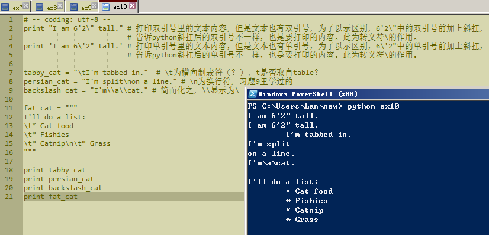

# 习题 10: 那是什么？

日期：20151029

给示范的例子写了注释

## 加分练习

1.上网搜索一下还有哪些可用的转义字符。

    转义符
     符 号	    说  明
      \'	  单引号
      \"	  双引号
      \a	  发出系统响铃声
      \b	  退格符
      \n	  换行符
      \t	  横向制表符
      \v	  纵向制表符
      \r	  回车符
      \f	  换页符
      \o	  八进制数代表的字符
      \x	  十六进制数代表的字符
      \000	  终止符，\000后的字符串全部忽略
      
    格式化字符串
     符  号	    说   明
      %c	 格式化字符及其ASCII码
      %s	 格式化字符串
      %d	 格式化整数
      %u	 格式化无符号整型
      %o	 格式化无符号八进制数
      %x	 格式化无符号十六进制数
      %X	 格式化无符号十六进制数（大写）
      %f	 格式化浮点数字，可指定小数点后的精度
      %e	 用科学计数法格式化浮点数
      %E	 作用同%e，用科学计数法格式化浮点数
      %g	 根据值的大小决定使用%f活%e
      %G	 作用同%g，根据值的大小决定使用%f活%e
      %p	 用十六进制数格式化变量的地址

2.使用 ''' (三个单引号)取代三个双引号，看看效果是不是一样的？    是一样的。

3.将转义序列和格式化字符串放到一起，创建一种更复杂的格式。

4.记得 %r 格式化字符串吗？使用 %r 搭配单引号和双引号转义字符打印一些字符串出来。 将 %r 和 %s 比较一下。 注意到了吗？%r 打印出来的是你写在脚本里的内容，而%s打印的是你应该看到的内容。