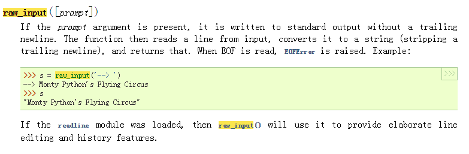

# 习题 11: 提问

做示范例子的时候，为什么我的运行结果最后一行身高那里没有转义符号\呢？

隔了半小时想到了，身高2后面我输得是两个单引号，而不是双引号。

## Study Drills
### 1.Go online and find out what Python's raw_input does.
https://docs.python.org/2/library/functions.html?highlight=raw_input

