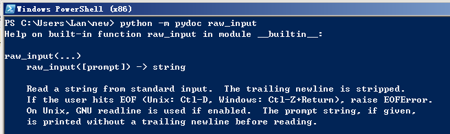
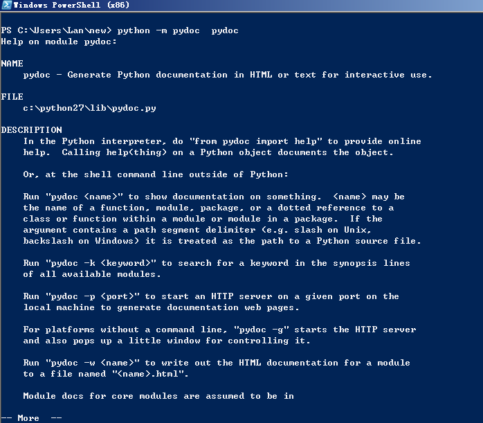

# Exercise 12:Prompting People

## Study Drills
### 1.In Terminal where you normally run python to run your scripts, type pydoc raw_input. Read what it says. If you're on Windows try python -m pydoc raw_input instead.

在PowerShell里面输入python -m podoc raw_input（我的电脑操作第是Windows7）。返回结果是raw_input这个函数的用法。

### 2.Get out of pydoc by typing q to quit.
退出pydoc请按q。是不是不退出pydoc，想查看某个函数的用法，直接输入函数名就可以了？

### 3.Look online for what the pydoc command does.

没去网上找了，仿照第一条直接在PowerShell里输入python -m podoc podoc。返回结果如下：

### 4.Use pydoc to also read about open, file, os, and sys. It's alright if you do not understand those; just read through and take notes about interesting things.
