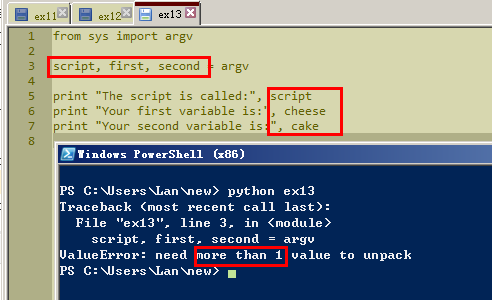
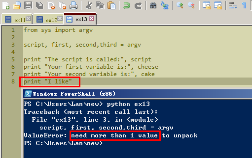
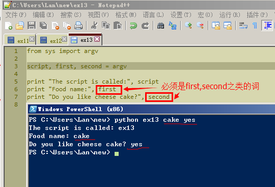

# Exercise 13:Parmeters,Unpacking,Variables

日期20151101

做示范例子的时，尝试在脚本里减少一个变量，在PowerShell运行后还是提示少了一个变量

随便加一个变量呢，也不行!

更新20151103

明白之前稍作改变的脚本为什么运行不成功了。在脚本里first和second之类的序数词是不能随意改动的。变量具体指代内容，在PowerShell运行时再给定就行了。示范的例子给了三个变量，自己改成只要给两个变量的。同理，在三个变量的基础上增减变量都是一样的了。

##Study Drills