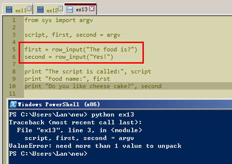
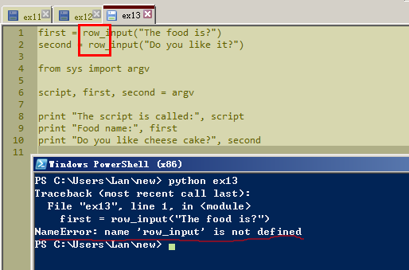
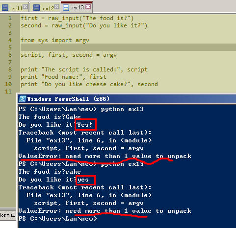
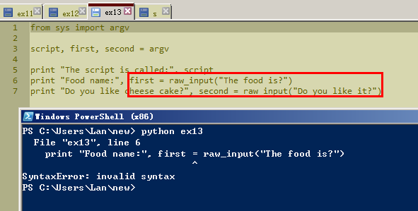
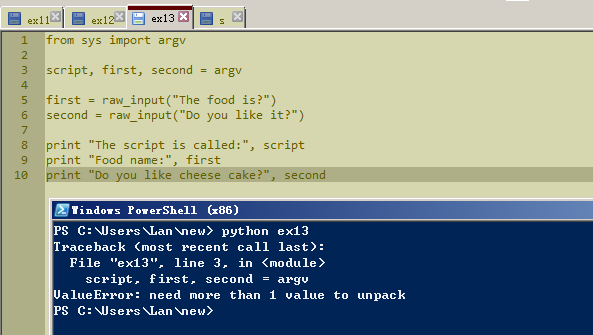
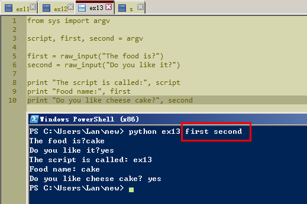
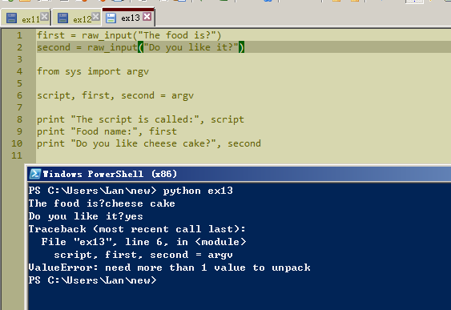

# Exercise 13:Parmeters,Unpacking,Variables

日期20151101

做示范例子的时，尝试在脚本里减少一个变量，在PowerShell运行后还是提示少了一个变量

随便加一个变量呢，也不行!

## 更新20151103

明白之前稍作改变的脚本为什么运行不成功了。在脚本里first和second之类的序数词是不能随意改动的。变量具体指代内容，在PowerShell运行时再给定就行了。示范的例子给了三个变量，自己改成只要给两个变量的。同理，在三个变量的基础上增减变量都是一样的了。

##Study Drills

### 1.Try giving fewer than three arguments to your script. See that error you get? See if you can explain it.

### 2.Write a script that has fewer arguments and one that has more. Make sure you give the unpacked variables good names.

在更新里已经试过了。

### 3.Combine raw_input with argv to make a script that gets more input from a user.

额，已经有点忘记raw_input的用法了。只能安慰自己没关系，再复习下就好了。

#### 尝试1

本来我还在想运行出错可能是不是要把frist和second的赋值内容放到from sys import agrv前面去。那就改下吧。

### 尝试2

又错了。raw_input写成了row_input。再改！

### 尝试3

第一运行fail以为是yes后面的！引起的，删掉还是出错。想不出是哪里错了，要不去官网上看看sys的说明吧。

### 尝试4

提示无效的语法。

### 尝试5

还是说少了参数要解包。在运行命令python ex13后加上first和second呢？

成功了

