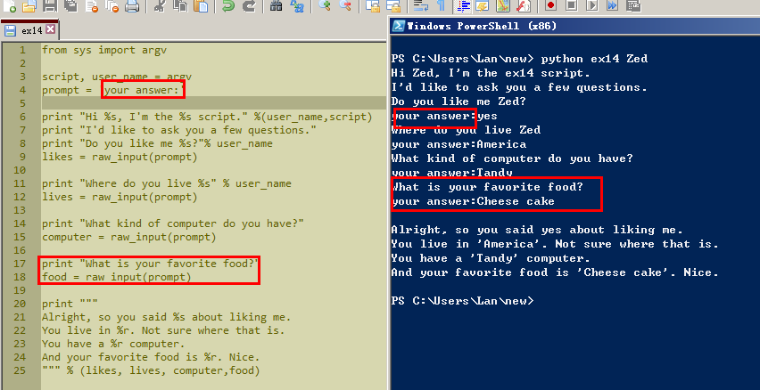

# Exercise 14: Prompting and Passing

日期20151103

这节练习想不到有什么可以变形的。

## Study Drills

### 1.Find out what Zork and Adventure were. Try to find a copy and play it

算了，不想玩。

### 2.Change the prompt variable to something else entirely.

### 3.Add another argument and use it in your script, the same way you did in the previous exercise with first, second = ARGV.

2和3的练习一起做了：

### 4.Make sure you understand how I combined a """ style multiline string with the % format activator as the last print.

