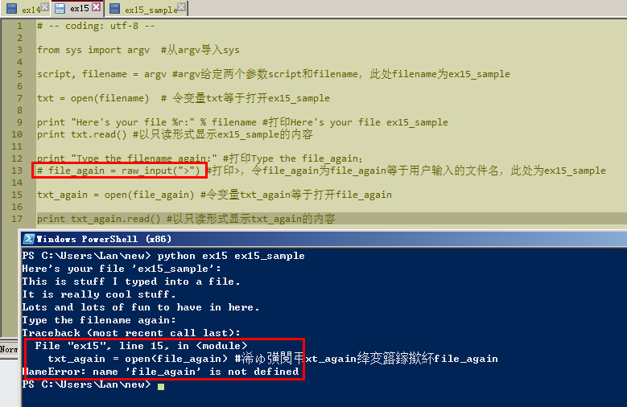

# 习题 15:

日期20151104

##Study Drills

###1.Above each line, write out in English what that line does.

###2.If you are not sure ask someone for help or search online. Many times searching for "python THING" will find answers to what that THING does in Python. Try searching for "python open."

###3.I used the word "commands" here, but commands are also called "functions" and "methods." You will learn about functions and methods later in the book.

###3.Get rid of the lines 10-15 where you use raw_input and run the script again.

为把13行的raw_input删掉，在这句前加上了#是一样的。运行后提示file_again这个变量找不到。

