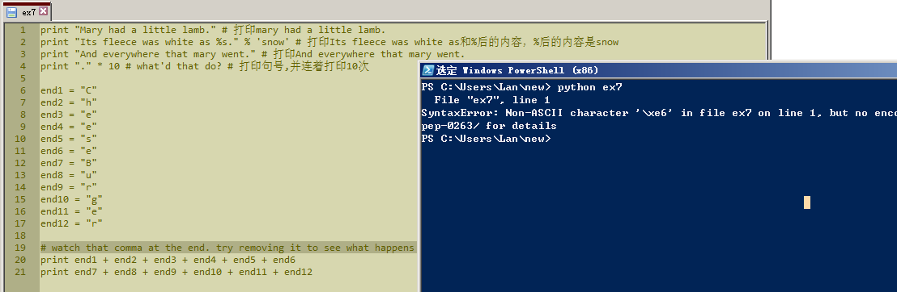
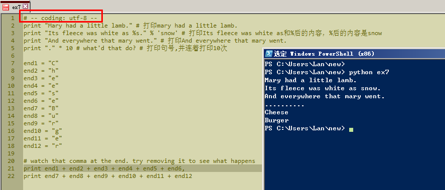
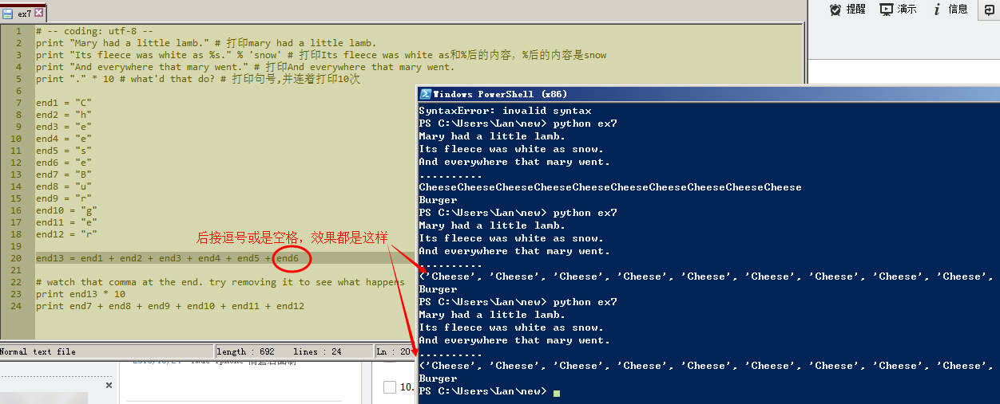

# 习题 7: 更多打印

日期：20151028

示范练习时20行，末尾有个逗号，试着删掉运行了下。有逗号和没逗号的效果图：

其实仔细想想应该还是想得到，没有逗号cheese和burger会分两行显示。因为1到4行结尾都没有逗号，在powershell里看到的效果就是垂直的4行。

## 加分练习
1.逆向阅读，在每一行的上面加一行注解。

本来觉得这个练习太简单，结果加了注释再运行，提示出现语法错误不成功（上图），应该是中文的原因，还给出了链接。点进去看了，又是一两屏的英文，不想看。想起习题5里面给过提示。于是照着改了下，再运行就成功了（下图）。

## ？？？
### 1.如果想垂直显示100个cheese?敲100遍吗？
### 2.如果水平显示100个cheese?每个cheese中间的空格？

