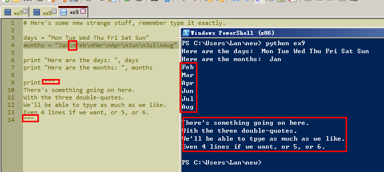
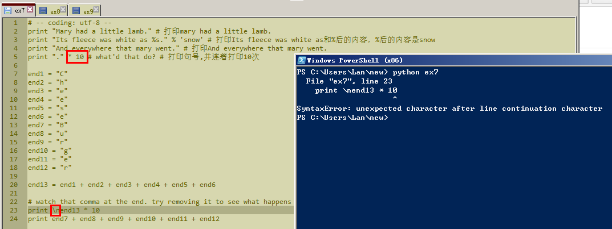
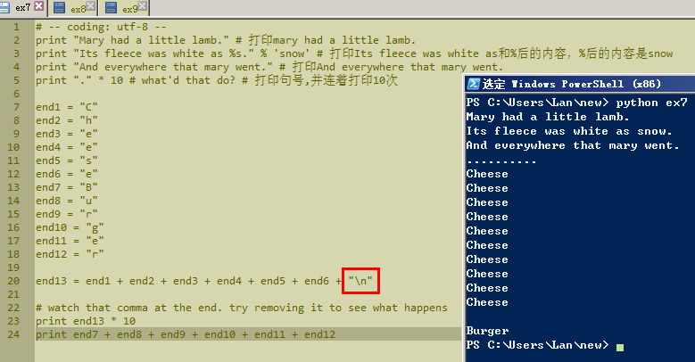
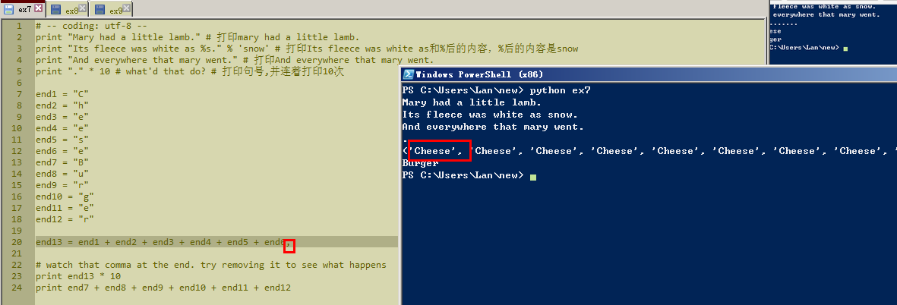
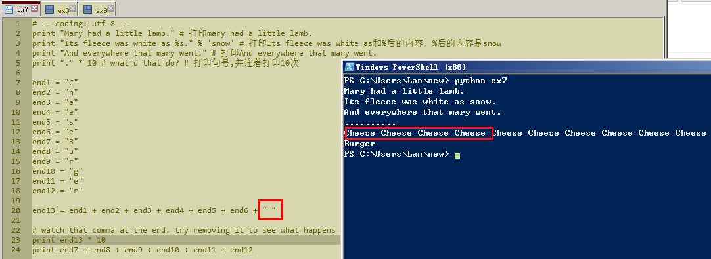

# 习题 9: 打印，打印，打印

这一节的练习学到了两个知识点,```\n```为换行符。两个符号```"""```间的多行内容，可以只用一个Print显示出来。而不用每行内容内都加上print。效果是这样的：



想到习题7里，自己想垂直打印100个cheese，是不是可以用到```\n```来实现呢？试了下，但是出错了：



想了下出错的原因，我猜是```\n```只有放在文本里才能起到换行的作用，但是end13在这里是个变量。于是又改了下打码，这次成功了。



依葫芦画瓢，水平显示100个cheese，是不是可行？习题7里说了英文逗号```,```起到的作用是空格。结果试出来是这样的效果：



不是我想要的。变量end13等于c+h+e+e+s+e+空格，干脆把公式改成这样，再运行，这次成功了。


