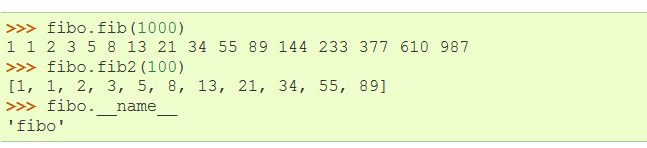

# modules

If you quit from the Python interpreter and enter it again, the definitions you have made (functions and variables) are lost. Therefore, if you want to write a somewhat longer program, you are better off using a text editor to prepare the input for the interpreter and running it with that file as input instead. This is known as creating a script. As your program gets longer, you may want to split it into several files for easier maintenance. You may also want to use a handy function that you’ve written in several programs without copying its definition into each program.

如果你从python退出又重新进入的话，你创建过的定义（函数和变量）将会丢失。因此，如果你想写一些长的程序，为了给输入python做准备工作你最好使用文本编辑器，and running it with that file as input instead(不知道怎么翻比较好)。这就是所谓的创建script。随着你的程序变长，为了更好的维护，你可能会想把程序分成几个文件。你可能也会想使用你已经在一些文件里写过的hardy函数，而不是复制函数到每个文件。


To support this, Python has a way to put definitions in a file and use them in a script or in an interactive instance of the interpreter. Such a file is called a module; definitions from a module can be imported into other modules or into the main module (the collection of variables that you have access to in a script executed at the top level and in calculator mode).

为了支持这种做法，python有种方法用来把定义放进一个文件，并且在script或an interactive instance of the interpreter中来使用这些定义。这种文件就叫module。一个module中的定义可以导入到其他的modules中或是主module中（你可以进入的script中的变量集合，在计算模式中会被优先执行）


A module is a file containing Python definitions and statements. The file name is the module name with the suffix .py appended. Within a module, the module’s name (as a string) is available as the value of the global variable __name__. For instance, use your favorite text editor to create a file called fibo.py in the current directory with the following contents:

Module是一种包括了python的定义和statements的文件。文件名是module名并加上.py的后缀。在一个module中，module的名字（作为字符串string）作为the value of the global variable_name_是可用的。举例来说，用你最爱的编辑器在现有directory建了个名叫fibo.py的文件，如下所示：


Now enter the Python interpreter and import this module with the following command:太简单不翻了


This does not enter the names of the functions defined in fibo directly in the current symbol table; it only enters the module name fibo there. Using the module name you can access the functions:

在现symbol table中，这步没有直接输入在fibo里定义的函数名称；仅仅只是输入了module的名字fibo。通过调用Module的名称，你可以直接进入这些函数：




If you intend to use a function often you can assign it to a local name:

如果你打算经常使用一个函数，你可以把它指定到本地名


## More on Modules
A module can contain executable statements as well as function definitions. These statements are intended to initialize the module. They are executed only the first time the module name is encountered in an import statement. [1] (They are also run if the file is executed as a script.)

就像函数一样，module也可以含有执行说明。这些说明是用来初如化module。他们只会在第一次module名字遇到。。。被执行。（如果文件像script执行，这些说明也会被执行）


Each module has its own private symbol table, which is used as the global symbol table by all functions defined in the module. Thus, the author of a module can use global variables in the module without worrying about accidental clashes with a user’s global variables. On the other hand, if you know what you are doing you can touch a module’s global variables with the same notation used to refer to its functions, modname.itemname.

每个module都有自己特有的结构，就像在module里所有函数所使用通用的结构那样。因此，module的作者可以使用global变量，而不用担心在使用global变量时出现意外的崩溃。从另一个方面来说，如果你知道。。。

Modules can import other modules. It is customary but not required to place all import statements at the beginning of a module (or script, for that matter). The imported module names are placed in the importing module’s global symbol table.

module可以导入其他的module。在module(或是script，for that matter)的开头，放置import的说明是默认的，但不是必须的。在导入的module的特征化的全局树型结构中，被导入的module

There is a variant of the import statement that imports names from a module directly into the importing module’s symbol table. For example

在导入说明里有个变量，


This does not introduce the module name from which the imports are taken in the local symbol table (so in the example, fibo is not defined).
There is even a variant to import all names that a module defines:
这部份没有介绍module的名字，


This imports all names except those beginning with an underscore (_).

这步导入了所有的名字，除了那些以下划线开头的部份。

Note that in general the practice of importing * from a module or package is frowned upon, since it often causes poorly readable code. However, it is okay to use it to save typing in interactive sessions.

要注意，一般来说从module或是压缩包里导入*是不赞同的，因为这经常会引起可读性很差的代码。但是，在interactive session里用来节省输入是没问题的。

### Executing modules as scripts 像脚本一般的执行

When you run a Python module with


the code in the module will be executed, just as if you imported it, but with the __name__ set to "__main__". That means that by adding this code at the end of your module:

module里的代码将会被执行，just as if you imported it, but with the  _name_ set to "_main_". 这意味着说在你的module后加上这行代码:

```if _name_ == "_main_":  
   import sys  
   fib(int(sys.argv[1]))```
   
   you can make the file usable as a script as well as an importable module, because the code that parses the command line only runs if the module is executed as the “main” file:
   
   你可以让文件变得不可用，因为。。。。
   
  ``` $ python fibo.py 50  
   1 1 2 3 5 8 13 21 34 ``` 
   
   If the module is imported, the code is not run:
   >>> import fibo
   >>>
   
   This is often used either to provide a convenient user interface to a module, or for testing purposes (running the module as a script executes a test suite).
   这常被用来给使用都提供方便，或是测目的（像script一样执行module会引发测试suite）.
   
### The Module Search Path

When a module named spam is imported, the interpreter first searches for a built-in module with that name. If not found, it then searches for a file named spam.py in a list of directories given by the variable sys.path. sys.path is initialized from these locations:

当一个名中spam的module导入的时候，翻译器首先会在内置module里进行搜索。如果没有找到，然后才会去变量sys.path给出的目录里找名叫spam.py的文件。sys.path是从这些地方被初始化的：

•the directory containing the input script (or the current directory).
•PYTHONPATH (a list of directory names, with the same syntax as the shell variable PATH).
•the installation-dependent default.

After initialization, Python programs can modify sys.path. The directory containing the script being run is placed at the beginning of the search path, ahead of the standard library path. This means that scripts in that directory will be loaded instead of modules of the same name in the library directory. This is an error unless the replacement is intended. See section Standard Modules for more information.

初始化后，python可以编辑sys.path。包含了正在运行script的目录会在一开始搜索路径的时候被取代。这也就是说，在那个目录下的script将会被